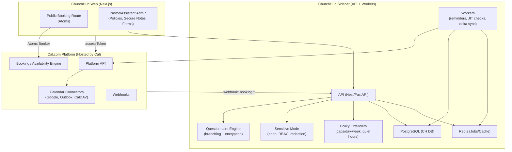

# ChurchHub — Cal Platform + Atoms Architecture (No Fork)

**Version:** 0.1  
**Last Updated:** 2025-10-05  
**Status:** Draft

## 1) High-Level System (Platform-first)



## 2) Booking Sequence (Conflict-Safe + Redaction)

```mermaid
sequenceDiagram
  participant User as Attendee (Browser)
  participant FE as ChurchHub Frontend
  participant CAL as Cal Platform (Atoms/Engine)
  participant SC as Sidecar (API/Workers)
  participant PROV as Google/Outlook/CalDAV

  User->>FE: Open /book/pastor-sam
  FE->>FE: Fetch managed-user accessToken (server-side)
  FE->>CAL: Render <Booker/> with accessToken
  User->>CAL: Select slot & submit
  CAL-->>SC: webhook booking.created(payload)
  SC->>PROV: JIT verify window (± buffer) across calendars
  alt Conflict
    SC->>CAL: cancel booking / propose alternative
    CAL->>User: slot unavailable → choose another
  else Free
    CAL->>PROV: Create provider event(s)
    CAL-->>SC: webhook booking.updated (provider IDs)
    SC->>SC: Encrypt intake; store; write redacted summary
    SC->>User: Send confirmation + reminders (email/SMS)
  end
```

## 3) Data Boundaries

- **Cal Platform (hosted):** users, event types, availability, bookings, provider tokens/IDs, scheduling engine.
- **ChurchHub Sidecar (self-hosted):** questionnaire schemas, **encrypted responses**, sensitivity flags, RBAC, audit logs, reminder schedules, policy rules.
- **Provider Calendars:** final events with **redacted** descriptions; no sensitive text leaves ChurchHub.

## 4) Minimal Backend Endpoints (Sidecar)

- `POST /webhooks/cal/booking.created` → JIT verify; hydrate intake record (pending)
- `POST /webhooks/cal/booking.updated` → link provider IDs; schedule reminders; write redaction
- `POST /forms` / `POST /forms/:id/respond` → branching & encryption
- `GET /bookings/:id/secure-notes` → RBAC + audited decrypt
- `POST /tokens/cal/managed-user` → issue short-lived accessToken for Atoms Booker
- `POST /policy/rebuild` → refresh slot caches / policies

## 5) Token Issuance (Pseudo)

```ts
// POST /tokens/cal/managed-user
// 1) Verify the public route maps to a specific pastor (managed user ID)
// 2) Request a short-lived Platform access token via Cal API using your Platform app credentials
// 3) Return token to FE (httpOnly cookie or SSR prop)

type TokenReq = { username: string };
type TokenResp = { accessToken: string, expiresAt: string };
```

## 6) What the UX Feels Like

- **Attendee:** One-page booking on your domain. If marked Sensitive, they see neutral wording in external invites; you keep full details secure.
- **Pastor:** Normal calendar views; a “View Secure Notes” link opens ChurchHub with decrypted intake, prep notes, and actions.
- **Assistant:** Can manage scheduling/policies; sees redacted intake unless granted permission.

## 7) Why Platform + Atoms (No Fork)

- Faster to ship, no AGPL obligations, painless upgrades.
- Still lets you enforce **policy** and **privacy** at commit time via sidecar.
- If Platform lacks a feature, request it—or add guardrails in sidecar JIT checks.

## 8) Open Questions

1. Do we generate **internal holds** before provider events, or rely on JIT only?
2. Any tenant requirements for data residency that affect Platform choice?
3. Minimum retention period for sensitive intake (30/90/365 days)?

